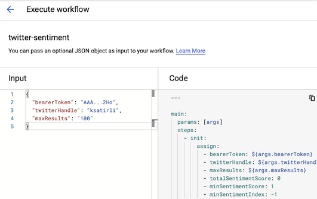

# Twitter Sentiment Analysis

> Easily analyze (emotional) sentiment of Tweets using Google Cloud and HashiCorp Terraform

## Table of Contents

- [Twitter Sentiment Analysis](#twitter-sentiment-analysis)
  - [Table of Contents](#table-of-contents)
  - [Requirements](#requirements)
  - [Usage](#usage)
  - [Notes](#notes)
  - [Author Information](#author-information)
  - [License](#license)

## Requirements

* Terraform CLI `1.0.9` or newer
* a Google Cloud [account](https://cloud.google.com/gcp)
* a Twitter  App [token](https://developer.twitter.com/en/portal/projects-and-apps)

## Usage

This repository contains [Terraform Resources](https://www.terraform.io) to deploy a [Google Workflow](https://cloud.google.com/workflows) for Twitter Sentiment Analysis.

To use this code, clone the repository and initialize Terraform:

```shell
cd twitter-sentiment-analysis-with-terraform

terraform init
```

The [init](https://www.terraform.io/docs/cli/commands/init.html) command will fetch all required Terraform Providers.

Next, execute a [plan](https://www.terraform.io/docs/cli/commands/plan.html):

```shell
terraform plan
```

> Note: The code is set up to use GCP Organization IDs. If your setup requires Folder IDs, change `maint.tf` and `variables.tf` in the appropriate locations.

If the preview looks good, you can deploy the resources using the [apply](https://www.terraform.io/docs/cli/commands/apply.html) command:

```shell
terraform apply
```

When Terraform finishes the `apply` process, several [Outputs](https://www.terraform.io/docs/language/values/outputs.html) will be displayed.

These Outputs contain URLs for the Google Cloud Console:

```shell
Outputs:

url_project_settings         = "console.cloud.google.com/iam-admin/settings"
url_service_account_detail   = "console.cloud.google.com/iam-admin/serviceaccounts/details"
url_service_account_overview = "console.cloud.google.com/iam-admin/serviceaccounts"
url_workflow_details         = "console.cloud.google.com/workflows/workflow/us-central1/twitter-sentiment/executions"
url_workflow_execution       = "console.cloud.google.com/workflows/workflow/us-central1/twitter-sentiment/create_execution"
url_workflows_overview       = "console.cloud.google.com/workflows"
```

> Note: The URLs will be specific to your account and will include Organization and Project IDs.

Find the Output with key `url_workflow_execution` and open the generated URL in a browser to display the Workflow Execution interface:



In this interface, add the following configuration as _Input_:

```json
{
  "bearerToken": "AAA...2Ho",
  "twitterHandle": "ksatirli",
  "maxResults": "100"
}
```

Modify the _Input_ payload to reflect your situation:

* Replace the value of `bearerToken` with an active Twitter App Bearer Token.
* Replace the value of `twitterHandle` with a relevant Twitter Handle.
* Adjust the value of `maxResults`, keeping in mind that the allowed range is 10 to 100.

Next, execute the Workflow by clicking the blue _EXECUTE_ button at the bottom.

After the Workflow has completed, the _Output_ will display the calculated values:

```json
{
  "averageSentiment": 0.25,
  "minSentimentIndex": 2,
  "minSentimentScore": -0.1,
  "numberOfTweets": 5,
  "totalSentimentScore": 1.5
}
```

## Notes

* For an overview of all input variables and output values, see [docs/inputs-and-outputs.md](./docs/inputs-and-outputs.md).

* The code in this repository is based on work done by Google Developer Advocates [@meteatamel](https://github.com/meteatamel) and [@KrisBraun](https://github.com/KrisBraun)
as part of a blog post highlighting [new Workflow processing capabilities](https://cloud.google.com/blog/topics/developers-practitioners/analyzing-twitter-sentiment-new-workflows-processing-capabilities).

## Author Information

This repository is maintained by the contributors listed on [GitHub](https://github.com/ksatirli/twitter-sentiment-analysis-with-terraform/graphs/contributors).

## License

Licensed under the Apache License, Version 2.0 (the "License").

You may obtain a copy of the License at [apache.org/licenses/LICENSE-2.0](http://www.apache.org/licenses/LICENSE-2.0).

Unless required by applicable law or agreed to in writing, software distributed under the License is distributed on an _"AS IS"_ basis, without WARRANTIES or conditions of any kind, either express or implied.

See the License for the specific language governing permissions and limitations under the License.
